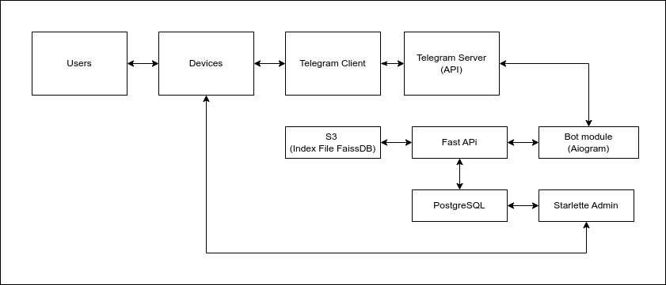
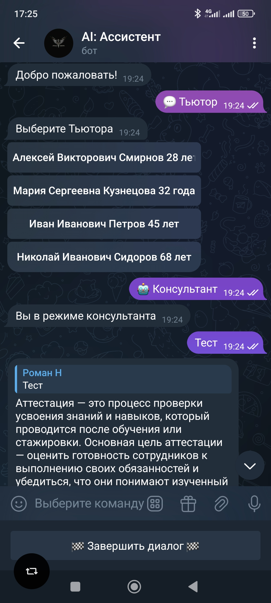
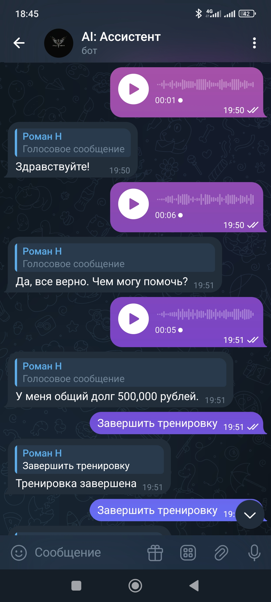

## Решение по проекту

Для проекта было предложено решение, которое отражено на схеме.

*Примечание: это был один из первых опытов создания подобных систем, поэтому решение именно такое. На данный момент есть возможность создавать более простые решения.*

## Описание

PostgreSQL использовалась для хранения записей о пользователях и их переписок в формате JSONB. Starlette Admin был **кастомизирован** и использовался как для доступа и редактирования базы, так и для просмотра диалогов. Для этого пришлось создать несколько дополнительных страниц с использованием элементов Bootstrap. Кроме того, в дополнительные страницы был встроен интерактивный дашборд, который отражал статистику расхода токенов. Для этого использовался Plotly.

В FastAPI была реализована вся основная логика ассистента. В качестве индексной базы была использована база FaissDB и библиотека Langchain. При поступлении запроса от пользователя скрипт сравнивал полученную информацию с базой, затем искал в базе варианты ответа и отвечал в заданном стиле за счёт API от OpenAI.

Поскольку основная логика была реализована в FastAPI, это даёт проекту возможность для интеграции с веб-версией.

Проект не предполагал большого количества пользователей, поэтому все компоненты были размещены на одном сервере. Однако при необходимости их можно легко перенести на различные машины.

Также в Telegram-боте были реализованы функции консультанта, который отвечает на вопросы на основе базы знаний заказчика, а также голосовые функции. С их помощью пользователь может обращаться к боту, отправляя аудиосообщения, которые расшифровываются на стороне сервера с использованием функционала OpenAI.

<table>
  <tr>
    <td></td>
    <td></td>
  </tr>
</table>
