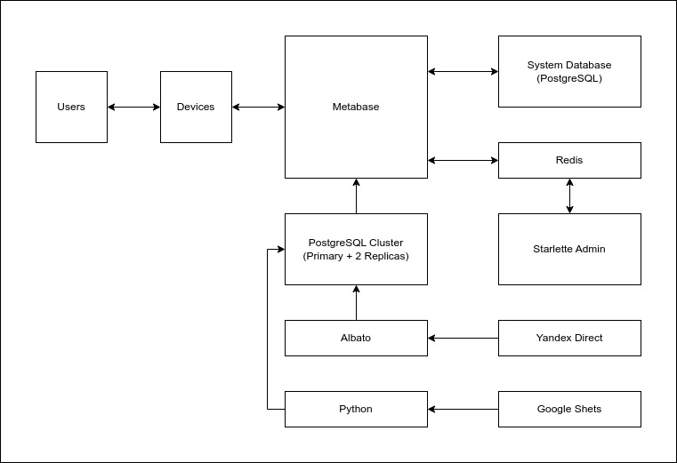
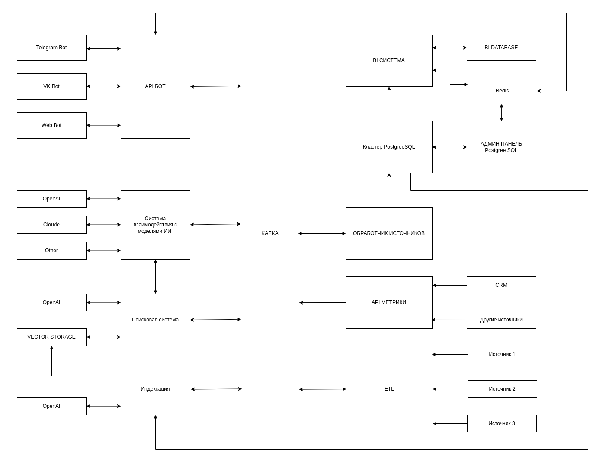

### Предложенное решение:

{width=761px height=521px}

#### **Сервер Metabase:**

| Железо  | Характеристика |
|---------|----------------|
| CPU     | 2CPU x 3.3 ГГц |
| RAM     | 2Гб            |
| Storage | 15ГБ NVMe      |

#### **Сервер Python + Starlette Admin:**

| Железо  | Характеристика |
|---------|----------------|
| CPU     | 1CPU x 3.3 ГГц |
| RAM     | 1Гб            |
| Storage | 15ГБ NVMe      |

#### **Остальные компоненты:**

| Компонент          | Описание                                    |
|--------------------|---------------------------------------------|
| Провайдер          | TimewebCloud                                |
| System Database    | Облачная PostgreeSQL                        |
| PostgreSQL Cluster | Облачная PostgreeSQL (Primary + 2 Replicas) |
| Albato             | Аккаунт заказчика                           |
| Google Shets       | Аккаунт заказчика                           |
| Yandex Direct      | Аккаунт заказчика                           |

### **Потенциал и заметки для будущего развития:**

{width=1401px height=1081px}
