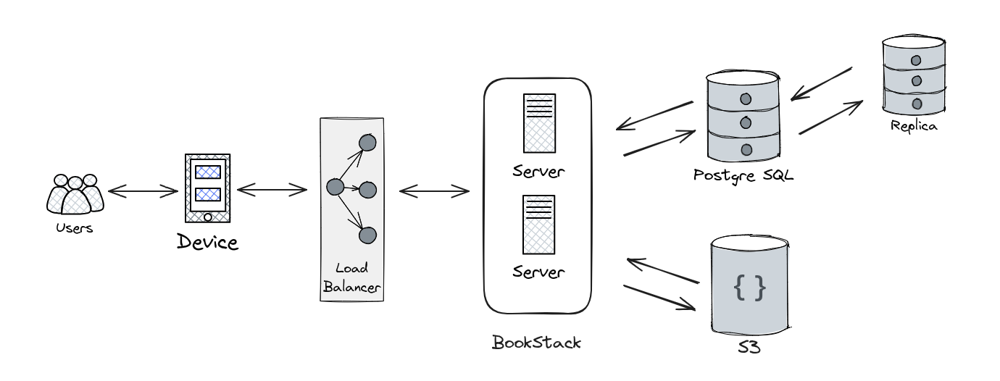

## **Архитектура проекта:**

### **Минимальные требования к серверу:**

| Железо  | Характеристика |
|---------|----------------|
| CPU     | 1CPU x 3.3 ГГц |
| RAM     | 1Гб            |
| Storage | 15ГБ NVMe      |

### **Дополнительная информация:**

**Кластер базы данных PostgreSQL:**

Используется кластер базы данных PostgreSQL и реплики для обеспечения отказоустойчивости и высокой доступности данных.

**Облачное хранилище S3 для хранения изображений и файлов:**

Для хранения изображений и файлов используется публичное облачное хранилище S3. Возможна кастомизация системы BookStack для работы с подписями закрытого хранилища.
