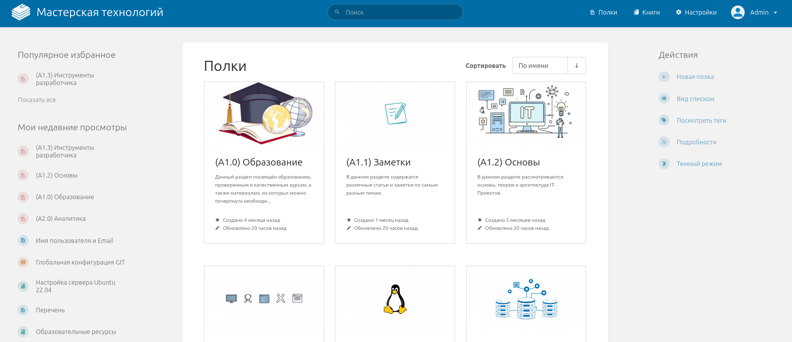
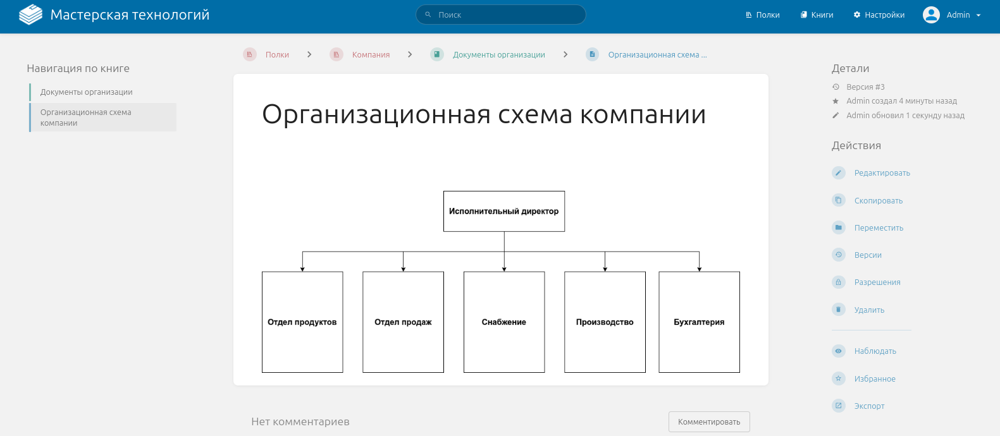

## **Корпоративная база знаний:**

Современное решение для централизованного хранения и структурирования корпоративной информации, обеспечивающее удобный доступ к знаниям, их быстрый поиск и эффективное использование.

{width=1573px height=680px}

{width=1581px height=690px}

## **Описание проекта:**

В качестве платформы для создания корпоративной базы знаний используется **BookStack** – современный, высокопроизводительный инструмент, который обеспечивает удобную организацию данных. BookStack делит информацию на логические блоки: полки, книги, главы и страницы, что позволяет создавать четкую и понятную иерархию знаний. Платформа обладает обширным API, что делает её легко интегрируемой с другими системами, а также поддерживает функции экспорта контента, включая формат PDF, для удобства использования вне системы.

Одним из **ключевых преимуществ** BookStack является его **интеграция с редактором диаграмм** [**draw.io**](http://draw.io), что позволяет создавать сложные схемы и визуализации непосредственно в интерфейсе. Удобный WYSIWYG-редактор упрощает процесс написания и форматирования текста, а поддержка синтаксиса Markdown и специальных блоков кода делает описание программного кода эффективным и наглядным.

Использование отдельной базы знаний, такой как **BookStack** , имеет ряд преимуществ по сравнению со встроенными инструментами других платформ. Встроенные решения часто ограничены функционалом основной системы и не обеспечивают достаточную гибкость для организации и управления контентом. Они изначально ориентированы на выполнение узкоспециализированных задач, что делает их менее эффективными для хранения и структурирования корпоративных знаний.

Другим аспектом является то, что по мере роста или развития компании часто возникает потребность в смене используемых инструментов, что означает и необходимость в переносе и оформлении базы знаний, а это существенная часть затрат. Поэтому использование отдельного инструмента решает эту проблему.

Кроме того, пользователям проще ориентироваться в отдельной системе с удобным интерфейсом, чем искать базу знаний внутри другой платформы. А BookStack как раз предоставляет удобный и понятный интерфейс с четкой иерархией данных: полки, книги, главы и страницы. Это особенно важно для компаний, где сотрудники ежедневно обращаются к базе знаний.

Следующим важным моментом является то, что BookStack обладает продвинутой системой ролей и прав доступа, которая позволяет настраивать доступ к информации так, чтобы каждый отдел мог работать только с теми материалами, которые относятся к его области ответственности. Это повышает безопасность данных и упрощает управление контентом.

Ввиду описанной выше информации можно сказать, что BookStack -- это универсальное решение, которое не зависит от других платформ, предоставляя компании надежный инструмент для управления корпоративными знаниями.