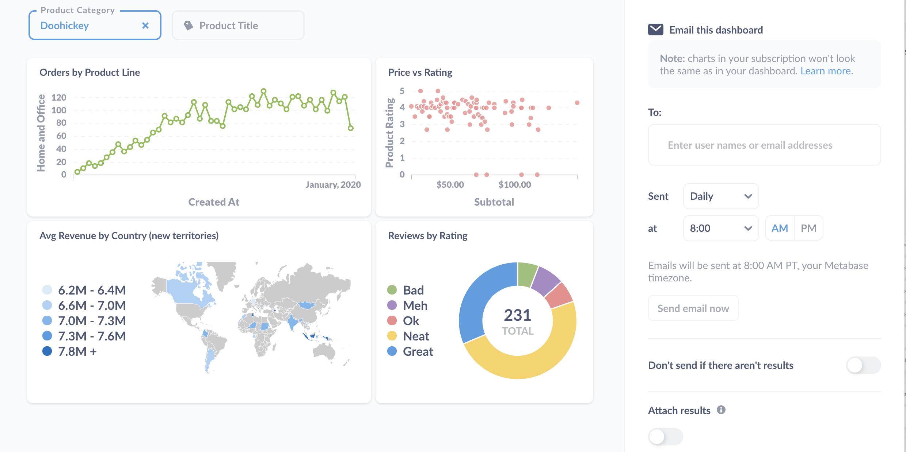

## **Описание платформы**

**Metabase** -- это open-source платформа для анализа данных и бизнес-аналитики, которая позволяет пользователям легко создавать запросы к базам данных без необходимости знания SQL или программирования. Она предоставляет интуитивно понятный интерфейс для визуализации данных, создания дашбордов и формирования отчетов. Metabase поддерживает подключение к различным источникам данных (например, PostgreSQL, MySQL, MongoDB и другим) и помогает как техническим, так и нетехническим специалистам получать полезные аналитические данные для принятия решений. Платформа фокусируется на простоте использования и доступности, что делает её популярным выбором для компаний, стремящихся к демократизации доступа к данным.

